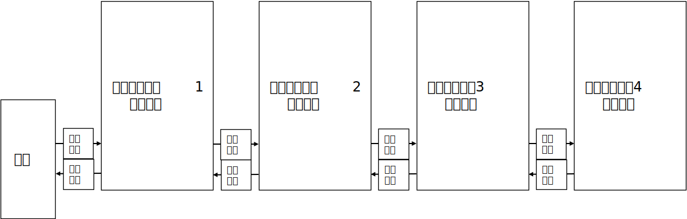
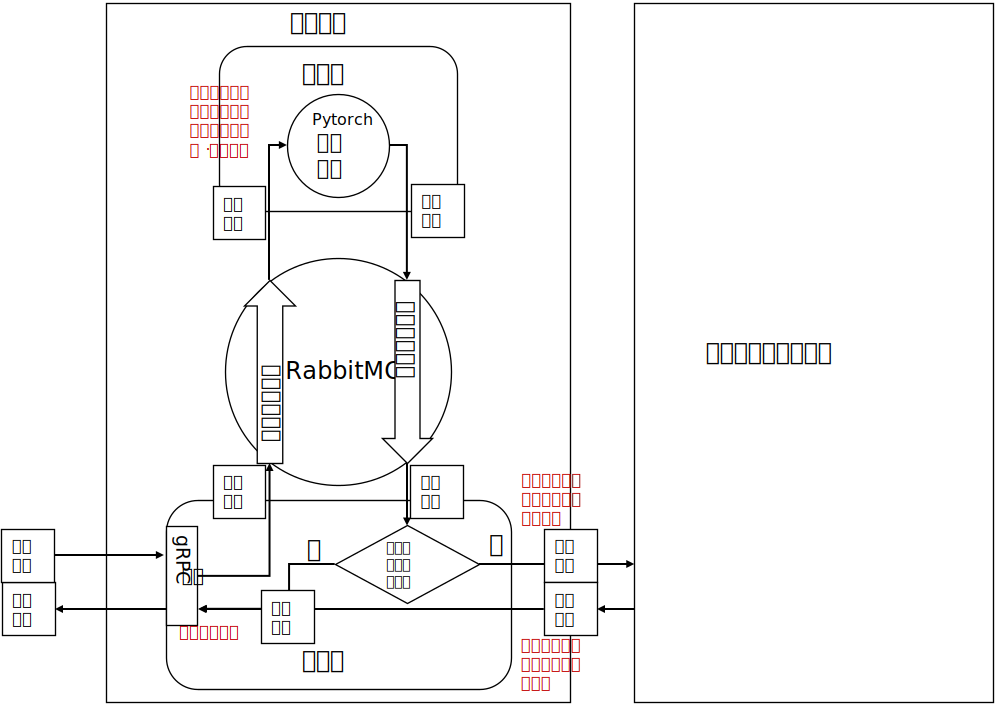
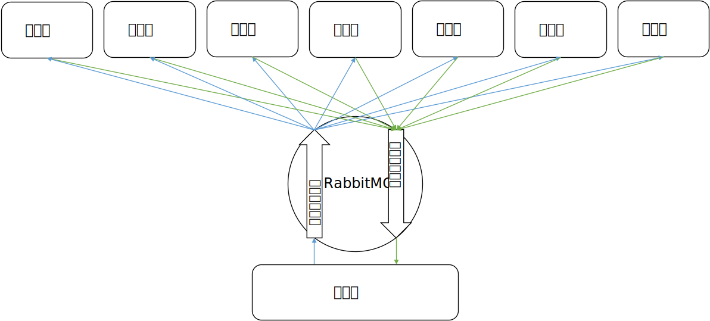

# DNet：一种级联的DDNN推断框架

## 整体结构



* 系统由一系列计算单元构成，每个计算单元接收计算请求，并返回计算结果
* 如果一个分块计算单元上的计算结果未能达到指定阈值，则计算单元自动向之后的分块计算单元发送计算请求，并将结果转发给请求方
  * 所谓“请求方”可以是终端，也可以是前一个分块计算单元
* 计算单元可以无限制地级联，而无所谓是在云端还是边缘

## 计算单元结构



* 计算层（包括神经网络+分支退出阈值）
  * 单线程执行，不允许抢占（避免GPU换入换出耗时）
  * 输入前一个单元传来的矩阵和起始层数
  * 执行神经网络计算，比较退出阈值
  * 输出
    * 阈值满足要求时：识别结果
    * 阈值不满足要求时：下一个单元的输入
* 传输层（包括下一个单元的请求地址）
  * 并发，需要端口复用
  * 接收前一个单元传来的矩阵和起始层数
  * 输入到计算层执行计算，等待计算结果
  * 输出
    * 如果计算层返回了识别结果，则返回
    * 如果计算层返回了下一个单元的输入，则请求下一个单元，等待并返回下一个单元的返回值
  * 计算层输出计算结果后立即开始计算下一个输入
* 中间层（基于RabbitMQ队列的RPC系统）
  * 负责计算层和传输层之间的通信
  * 此层的存在只是因为多语言编程和异步的需要，如果计算层和传输层由同种语言异步实现，则不需要传输层
  * 传输层将收到的数据传到中间层队列中，并等待返回
  * 计算层从中间层队列中接收数据，执行计算，返回结果

### 单传输层多计算层

* 一个计算单元中可以有多个计算层处理计算请求
* 传输层通过AMQP协议中的“消息ID”机制将计算请求和计算结果一一对应
* 不可以有多个传输层，因为消息ID不能在传输层间共享



## 运行计算层

### 直接运行

```sh
$ python ComputationUnit -h
Usage: ComputationUnit [options]

Options:
  -h, --help            show this help message and exit
  -a ADDRESS, --address=ADDRESS
                        要连接的RabbitMQ服务器地址和端口
  -q QUEUENAME, --queuename=QUEUENAME
                        接收计算请求的RabbitMQ队列名
  -e EXITLAYER, --exitlayer=EXITLAYER
                        出口位置
```

#### 示例

```sh
git clone https://github.com/yindaheng98/torch-models
mv ./torch-models/multi-exit-inception-v3-cifar10-epoch53.pkl ./ComputationUnit/multi-exit-inception-v3-cifar10-epoch53.pkl
rm -rf ./torch-models
# 模型文件太大于是给放到别的repo里面了，要先下载才能运行

python -m venv ./ComputationUnit/venv
./ComputationUnit/venv/Scripts/activate.ps1
pip install -r ./ComputationUnit/requirements.txt
pip install torch==1.7.0+cpu torchvision==0.8.1+cpu torchaudio===0.7.0 -f https://download.pytorch.org/whl/torch_stable.html
#装好环境

docker run -it --rm --name rabbitmq -p 5672:5672 -p 15672:15672 rabbitmq:alpine
python ComputationUnit -a 192.168.1.2 -q q8 -e 8 # 连到192.168.1.2、队列名q8、从第8层退出
python ComputationUnit -a 192.168.1.2 -q q12 -e 12 # 连到192.168.1.2、队列名q12、从第12层退出
python ComputationUnit -a 192.168.1.2 -q q16 -e 16 # 连到192.168.1.2、队列名q16、从第16层退出
```

### Docker运行

Dockerhub地址是[yindaheng98/dnet-computationunit](https://hub.docker.com/repository/docker/yindaheng98/dnet-computationunit)。内置模型文件无需额外下载，运行指令同上。

```sh
docker run -it --rm --name rabbitmq -p 5672:5672 -p 15672:15672 rabbitmq:alpine
docker run --rm -it yindaheng98/dnet-computationunit python ComputationUnit -a 192.168.56.1 -q q8 -e 8 # 连到192.168.56.1、队列名q8、从第8层退出
docker run --rm -it yindaheng98/dnet-computationunit python ComputationUnit -a 192.168.56.1 -q q12 -e 12 # 连到192.168.56.1、队列名q12、从第12层退出
docker run --rm -it yindaheng98/dnet-computationunit python ComputationUnit -a 192.168.56.1 -q q16 -e 16 # 连到192.168.56.1、队列名q16、从第16层退出
```

## 运行传输层

### 直接运行

```sh
$ cd TransmissionUnit
$ npm run start -- -h

Usage: index [options]

Options:
  -V, --version                          output the version number
  -l, --listen-address <listen-address>  gRPC服务器将要监听的IP地址和端口 (default: "0.0.0.0:8080")
  -a, --amqp-address <amqp-address>      与计算层通讯的RabbitMQ服务器接口地址 (default: "amqp://localhost")
  -q, --queue-name <queue-name>          与计算层通讯的RabbitMQ队列名称 (default: "ComputationQueue")
  -n, --next-address <next-address>      如果此服务器运行在边缘，此处指定下一套模型（云端）的gRPC服务器位置 (default: "")
  -h, --help                             display help for command
```

#### 示例

```sh
npm run start -- -l 0.0.0.0:8082 -a amqp://192.168.1.2 -q q16
npm run start -- -l 0.0.0.0:8081 -a amqp://192.168.1.2 -q q12 -n localhost:8082
npm run start -- -l 0.0.0.0:8080 -a amqp://192.168.1.2 -q q8 -n localhost:8081
```

### Docker运行

Dockerhub地址是[yindaheng98/dnet-transmissionunit](https://hub.docker.com/repository/docker/yindaheng98/dnet-transmissionunit)。运行指令同上。

```sh
docker run --rm -it -p 8082:8080 yindaheng98/dnet-transmissionunit npm run start -- -a amqp://192.168.56.1 -q q16
docker run --rm -it -p 8081:8080 yindaheng98/dnet-transmissionunit npm run start -- -a amqp://192.168.56.1 -q q12 -n 192.168.56.1:8082
docker run --rm -it -p 8080:8080 yindaheng98/dnet-transmissionunit npm run start -- -a amqp://192.168.56.1 -q q8 -n 192.168.56.1:8081
```

## 运行测试

### 直接运行

```sh
$ cd test
$ python TransmissionUnit.test.py -h
Usage: TransmissionUnit.test.py [options]

Options:
  -h, --help            show this help message and exit
  -a ADDRESS, --address=ADDRESS
                        要测试服务器地址和端口
  -n NUMBER, --number=NUMBER
                        测试多少张图片
  -e EXIT, --exit=EXIT  在第几层退出
```

#### 示例

```sh
python -m venv ./ComputationUnit/venv
./ComputationUnit/venv/Scripts/activate.ps1
pip install -r ./ComputationUnit/requirements.txt
#装好环境

cd test
python load_data.py
# 加载数据集

python TransmissionUnit.test.py -a 192.168.56.1:8080
```

### Docker运行

Dockerhub地址是[yindaheng98/dnet-testunit](https://hub.docker.com/repository/docker/yindaheng98/dnet-testunit)。运行指令同上。

```sh
docker run --rm -it yindaheng98/dnet-testunit python TransmissionUnit.test.py -a 192.168.56.1:8080
```

## K8S部署示例

见[example](./example)。

## 开发调试中遇到的问题

见[《开发调试中遇到的问题》](./开发调试中遇到的问题.md)。